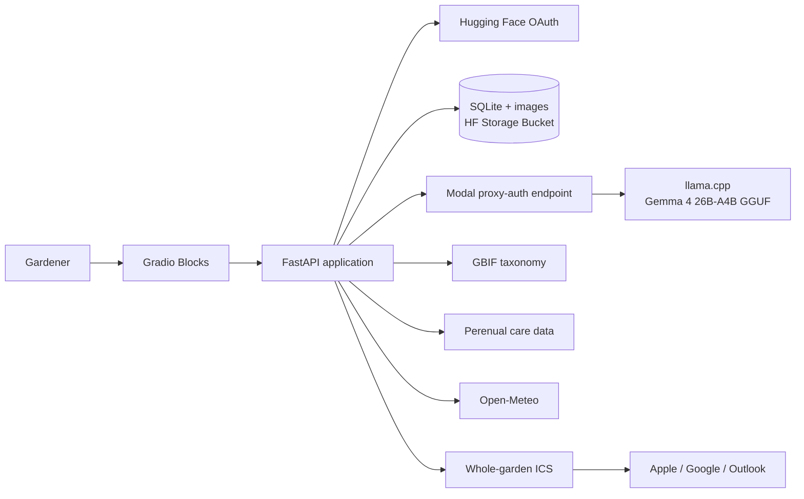

# Waterleaf Architecture

## Identification

1. Gemma extracts visible traits, candidate names, container status, and size.
2. GBIF resolves names to valid `Plantae` species records.
3. Gemma reranks only those records. Unknown keys are discarded.
4. The user confirms a candidate or replaces it through taxonomy autocomplete.

## Scheduling

Perenual provides a baseline interval. Waterleaf shortens the interval for
containers, applies bounded rain and heat adjustments to the 16-day forecast,
and labels later dates as seasonal estimates. The language model never chooses
watering dates.

## Privacy

HF username is the private ownership key. Coordinates are rounded before
storage. Public plant profiles use opaque slugs and omit account and location
data. Uploaded images are resized, converted to JPEG, and stripped of EXIF.

