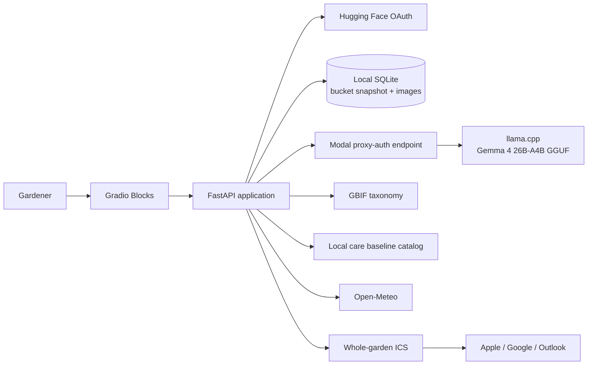

# Field Notes: Turning a Garden Photo into a Watering Calendar

The narrow question behind Waterleaf is simple: after a plant is identified,
what useful thing happens next? A species name can be informative, but it is
not an action. The working product hypothesis here is that a gardener gets more
value from a concrete calendar artifact than from an identification result
alone. Waterleaf therefore treats identification as the first step in a
workflow whose real output is an editable watering plan and one portable
calendar export for the whole garden.

That framing matters because this report is about product direction and system
design, not a completed user study. I do not have a formal usability result, a
gardener quote, or a statistically grounded claim that this flow is the best
possible answer. The current repo supports the hypothesis that a photo can be
turned into a more useful gardening artifact. It does not yet prove user
outcomes beyond that.

## Architecture

## From image to grounded options

Waterleaf splits plant identification into two jobs on purpose. Gemma is used
for visible observations, not as the authority on taxonomy. The multimodal
model receives one to three plant photos and is constrained to return only four
fields: visible traits, proposed names, whether the plant appears to be in a
container, and a rough size label. In other words, the model is allowed to say
what it sees and what names might fit those visible cues. It is not allowed to
invent hidden care details, a planting history, or a final species decision.

Those proposed names are then resolved through the GBIF Species API. Waterleaf
keeps only valid `Plantae` records from that database step and asks Gemma to
rerank only those valid records against the images and observed traits. Unknown
keys are discarded. A reranked candidate that does not correspond to a real
GBIF record is ignored. The user then confirms one of those candidates or
replaces it through taxonomy autocomplete. That division of responsibility is
the key product posture: observations from the model, taxonomy from GBIF, and
the final choice from the person.

This is also why the demo language stays away from certainty. The model
suggests; the gardener confirms. That line is not presentation polish. It is
the actual system boundary in the code.

## Running Gemma 4 through llama.cpp

The inference stack is intentionally narrow and explicit. Waterleaf runs
`google/gemma-4-26B-A4B-it` through the
`ggml-org/gemma-4-26B-A4B-it-GGUF` repository as a `Q4_K_M` GGUF. I verified
the upstream model card wording before publishing this report: the model is
roughly 4B active parameters with 25.2B total, which is comfortably under 32B.
That makes it a credible fit for the hackathon's "build something small"
constraint while still being large enough to handle multimodal extraction and
bounded reranking.

The runtime is a pinned llama.cpp CUDA server image,
`server-cuda13-b9445`, deployed on a Modal L4 with a protected web endpoint.
The current configuration uses:

- 8K context
- full GPU offload
- Flash Attention
- `q8_0` K/V cache
- one parallel slot
- automatic multimodal projector loading

The first pass is a strict JSON-schema extraction call with thinking disabled.
The rerank pass is also strict JSON, but it enables thinking with a bounded
256-token reasoning budget before returning the final JSON payload. This keeps
the first model interaction tightly constrained to visible observations and
lets the second interaction spend a small, explicit amount of reasoning budget
only on ranking valid database candidates. The Space itself remains a small CPU
application; the heavier multimodal inference work is isolated behind the
Modal service.

## Deterministic scheduling, not model-authored dates

Once a species is confirmed, Waterleaf stops asking the model to improvise.
Scheduling is deterministic code.

The local care catalog stores minimum and maximum day ranges for supported
plants. When a species is known in the catalog, Waterleaf computes an interval
from the average of that min/max pair. When a species has no baseline, the user
must provide a manual interval. Container plants shorten the interval with a
container factor. Near-term forecast rules can then shift dates in bounded
ways:

- forecast rain can defer watering by two days
- hot, drying conditions can advance watering by one day
- dates after the 16-day forecast window are labeled as seasonal estimates

Every generated event remains editable before save. The language model never
chooses watering dates. It only contributes structured observations that help
the gardener reach a confirmed species. The schedule comes from local baselines,
manual input when needed, and explicit weather rules.

That separation also makes the fallback behavior legible. If forecast retrieval
or forecast parsing fails, the weather client returns no forecast rows. The app
still produces a schedule from the care baseline or manual interval, but it
loses the rain and heat adjustments that depend on forecast rows. By contrast,
geocoding or location lookup failure stops schedule preview and must be
corrected before the flow can continue. The system degrades to a simpler
deterministic plan only when forecast data is unavailable after location has
already been resolved.

## The calendar is the product

The core artifact is one RFC 5545 ICS export for the whole garden. Each saved
plant contributes timed watering events to the same file. In the current repo,
those events are 15 minutes long, carry a stable UID per plant/date pair, use
the plant's local time zone, and include a display alarm. Event text includes
the species and the reason that produced the date, such as a baseline cadence
or a forecast rain defer.

Each calendar event also carries two links back to the saved plant context: a
public profile URL and an image URL attached as `ATTACH`. This is the concrete
answer to the opening product question. Weeks later, the reminder can still
show the plant image and point back to the specific plant page, rather than
forcing the gardener to remember which lavender or tomato that event referred
to.

Calendar clients are inconsistent about attachments, and that inconsistency is
already documented in the repo. Some clients surface the attached image cleanly
and some do not. The profile link is therefore the portable fallback. The
artifact is designed around the reality that an ICS file travels into other
software with uneven feature support.

## Privacy and public links

Waterleaf keeps the public artifact intentionally narrow. Uploaded plant images
are normalized to JPEG, resized, and rewritten without EXIF. Stored
coordinates are rounded before persistence. Public plant pages omit account
identity and location details. The public URL is an opaque slug rather than an
exposed database key.

That said, the slug is not presented as a security boundary. The public plant
page is intentionally public because a calendar reminder needs to open it
without requiring a session handoff from whichever calendar client receives the
ICS file. The right way to describe that design is "public by product choice,
with reduced metadata," not "secret because the URL looks random."

## Evidence I can claim today

The evidence in this branch is narrower than the final submission story, and it
should stay narrow until more proof exists.

Currently verified facts:

- the public Space root returned HTTP 200
- the public `/health` endpoint returned HTTP 200 and `{"status":"ok"}`
- all 40 tracked application tests pass
- `uv run ruff check .` is clean

Those tests cover the system categories that matter for the current claims:
constrained multimodal requests, grounded reranking, scheduler behavior and
forecast fallback, image normalization, owner isolation, public privacy
boundaries, and ICS generation. The deployed Space has also completed a fresh
guest run through upload, visual analysis, GBIF candidate confirmation, and
schedule preview. Save, ICS export, and public-profile footage was captured
from the same application code with isolated local data. A deployed OAuth
save/export/profile run remains pending and is not claimed here.

## What Waterleaf does not claim

There is no real labeled benchmark in the repo yet, so Waterleaf does not make
an accuracy claim. There is no repeatable latency report in the repo yet, so it
does not make a latency claim either. It also does not claim Off the Grid or
fully local execution. Inference runs on Modal, taxonomy depends on GBIF, and
weather enrichment depends on Open-Meteo. Those are all deliberate choices in
the current architecture.

## Failure modes and limitations

- Image ambiguity remains real; some plants simply do not expose enough visible
  evidence in one to three photos.
- Confirmation is required because the model is proposing candidates, not
  authorizing a truth label.
- External dependencies matter: Modal, GBIF, and Open-Meteo can all fail or
  rate limit.
- The local care catalog is intentionally small and sometimes requires a manual
  interval.
- Forecast-aware adjustments only reach as far as the 16-day forecast window.
- ICS attachment behavior varies across calendar clients.
- Public plant links are intentionally public and should not be treated as
  confidential records.
- Watering suggestions are not a horticultural guarantee.

## What this project taught me

The most useful lesson is that observations are more valuable than false
certainty. A multimodal model can help by describing visible traits and
proposing names, but taxonomy still belongs to a real database, and the final
selection still belongs to the person. Once the species is confirmed, the
calendar should come from deterministic, editable logic rather than a model
hallucinating dates.

That same lesson shows up in the submission artifact itself. The strongest
demo is not a generic "AI plant identifier" form. It is a compact
photo-to-calendar story: visible observations, grounded taxonomy rerank, human
choice, deterministic scheduling, editable dates, and one portable calendar
export that still carries the original image context forward.

## Links

- Space: <https://huggingface.co/spaces/build-small-hackathon/waterleaf>
- Source: <https://github.com/hkaraoguz/waterleaf>
- Demo: <https://www.youtube.com/watch?v=4H5vGVFcaO4>
- Social post: <https://x.com/hknkrgz/status/2066605985741807972>
- Architecture: [architecture.md](architecture.md)

## Demo

The public 30-second demo is available on
[YouTube](https://www.youtube.com/watch?v=4H5vGVFcaO4), and the accompanying
social post is available on
[X](https://x.com/hknkrgz/status/2066605985741807972).

## Demo image attribution

Licensed demo image: "Lavender plants growing in a garden" by Brooke
Balentine. Available under the Unsplash License:
<https://unsplash.com/photos/lavender-plants-growing-in-a-garden-o-8pxOIAJcg>
